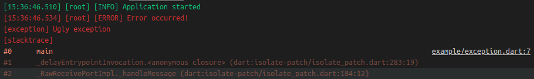

# loggerx

 

Tiny but powerful logger with default root logger and ability to create custom loggers with runtime level filtering.

## About

Logger supports 6 levels of logging which are `none`, `error`, `warning`, `info`, `debug` and `verbose`.

Loggers also supports attaching `exception` and `stackTrace` objects to logging functions that will produce next output:

## Example

Example is available in [example.dart](example/example.dart) file.

## Author

GitHub: [abobija](https://github.com/abobija) 
Homepage: [abobija.com](https://abobija.com)

## License

[MIT](LICENSE)