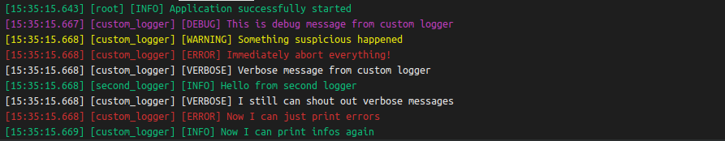
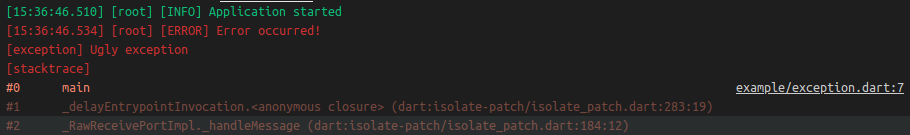

# loggerx

Tiny but powerful console logger with default root logger and ability to create custom loggers with runtime level filtering.

## About

Logger supports 6 levels of logging which is `none`, `error`, `warning`, `info`, `debug` and `verbose`.

Loggers also supports attaching `exception` and `stackTrace` objects to logging functions:

## Example

Example is available in [example.dart](example/example.dart) file.

## Author

GitHub: [abobija](https://github.com/abobija) 
Homepage: [abobija.com](https://abobija.com)

## License

[MIT](LICENSE)